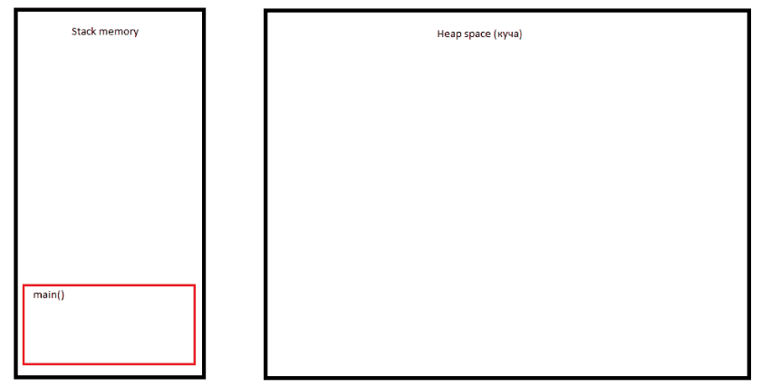

# Задача "Понимание JVM"

## Описание
Просмотрите код ниже и опишите (текстово или с картинками) каждую строку с точки зрения происходящего в JVM

Не забудьте упомянуть про:
- ClassLoader'ы,
- области памяти (стэк (и его фреймы), хип, метаспейс)
- сборщик мусора

## Код для исследования
```java

public class JvmComprehension {

    public static void main(String[] args) {
        int i = 1;                      // 1
        Object o = new Object();        // 2
        Integer ii = 2;                 // 3
        printAll(o, i, ii);             // 4
        System.out.println("finished"); // 7
    }

    private static void printAll(Object o, int i, Integer ii) {
        Integer uselessVar = 700;                   // 5
        System.out.println(o.toString() + i + ii);  // 6
    }
}

```

## Ответ:

### 1 :
```java
        int i = 1;                      // 1
```
После вызова метода main(), в стеке создается фрейм. Следующей строчкой кода создается переменная int i = 1, в созданном
блоке стека.

### 2 :
```java
        Object o = new Object();        // 2
```
Создается объект в куче, затем записывается ссылка на него в блоке стека.

### 3 :
```java
        Integer ii = 2;                 // 3
```
Т.к. Integer — это класс-оболочка, который имеет свои объекты, здесь создается объект в куче со значением 2, и ссылкой
на него в блоке стека.

### 4 :
```java
        printAll(o, i, ii);             // 4
```
При вызове метода printAll(), в стеке создается новый фрейм, а предыдущий становится закрытым, и все переменные
становятся недоступны. Т.к. метод вызывался с параметрами, то в нем сразу создаются новые переменные и им присваиваются
соответствующие ссылки на объекты.

### 5 :
```java
        Integer uselessVar = 700;                   // 5
```
Как и в пункте 3, создается объект класса Integer в куче, и ссылка на него в стеке.

### 6 :
```java
        System.out.println(o.toString() + i + ii);  // 6
```
При вызове метода printLn(), происходит все тоже самое, что и с printAll(). Только там при формировании строки, для
вывода в консоль, из полученных данных будет ещё вызван метод toString().

### 7 :
```java
        System.out.println("finished"); // 7
```
После выполнения метода он удаляется из стека, так методы println() и printAll() удаляются, после выполнения, при этом
объекты созданные пока остаются, пока не запустится сборщик мусора и не удалит их(если программа не завершится раньше).
Последним вызывается метод println(), из выполняемого метода main().
